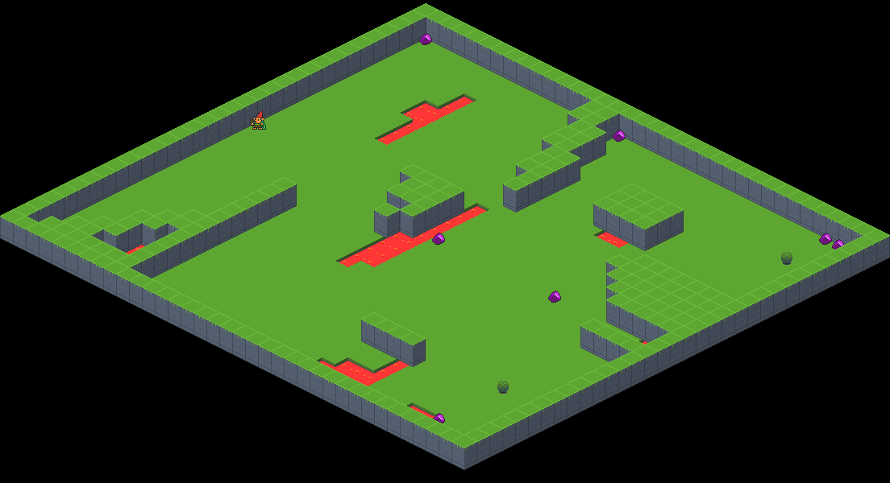

# <p align="center"> Griddly </p>
<div align="center">

[](https://discord.gg/xuR8Dsv)
[](https://badge.fury.io/py/griddly)

</div>


A heavily optimized and flexible grid-world game engine for Game AI research.

#  Some features
* Design and build game mechanics using a simple YAML-based language: [GDY](https://griddly.readthedocs.io/en/latest/getting-started/gdy/index.html)
* **Fast execution speed** environments can run up to 70k FPS on a single thread.
* Don't worry about complex efficient rendering code, just define the images for each game object and Griddly passes this to the GPU.
* Supports **Single Agent**, **Multi Agent** and **RTS** environment interfaces.
* **[Multiple observervation modes](https://griddly.readthedocs.io/en/latest/getting-started/observation%20spaces/index.html)**:
  * Vectorized
    * Configurable one-hot encodings for each x,y coordinate
  * Rendered 
    * Isometric, sprites and simple shapes
    * We also let you use **custom shaders** to render however you want!
  * State Maps
    * Description of the entire environment including objects, locations and variables.
  * Event History
    * Descriptions of actions that have happened in each step.
  * Configurable partial observability
* **Copyable Forward Models**
  * Game state can be cloned at any point in time. This is super useful for many Algorithms. For example Mont-Carlo Tree Search.
* **[Procedural Content Generation Interfaces](https://griddly.readthedocs.io/en/latest/getting-started/procedural%20content%20generation/index.html)**


* Reinforcement Learning with [RLLib](https://griddly.readthedocs.io/en/latest/rllib/intro/index.html)
  * Integration with [Wandb](https://griddly.readthedocs.io/en/latest/rllib/intro/index.html#weights-and-biases-wandb)


#  Some Environments

<div>
  <a href="https://griddly.readthedocs.io/en/latest/games/Spider_Nest/index.html"></a>
  <a href="https://griddly.readthedocs.io/en/latest/games/GriddlyRTS/index.html"></a>
  <a href="https://griddly.readthedocs.io/en/latest/games/Clusters/index.html"></a>
</div>

[Check out the full list of pre-built environments here](https://griddly.readthedocs.io/en/latest/games/index.html)


#  Community
Join the [Discord community](https://discord.gg/xuR8Dsv) for help and to talk about what you are doing with Griddly!


#  Documentation

Full documentation can be found here:
[griddly.readthedocs.org](https://griddly.readthedocs.org)

#    Tutorials

The most awesome part of Griddly is the ability to easily customize and build your own research environments. To make this extra easy we've written lots of tutorials:

## [Making A Simple Game (Sokoban)](https://griddly.readthedocs.io/en/latest/tutorials/GDY/index.html)
  * This tutorial takes you through how to create a simple game environment using GDY.
  
## Game Mechanics
  * [Proximity Triggers](https://griddly.readthedocs.io/en/latest/tutorials/Proximity%20Triggers/index.html)
    * Configure interactions between objects based on their distance.
  * [Projectiles](https://griddly.readthedocs.io/en/latest/tutorials/Projectiles/index.html)
    * Objects that move under their own power.

## [Custom Shaders](https://griddly.readthedocs.io/en/latest/tutorials/Custom%20Shaders/index.html)
  * Customize rendering for environments using SPIR-V shaders.
<div>
  
  
  
</div>

#  Installing

<div align="center">

```
pip install griddly
``` 

Build Status
| OS       |  Status  |
|----------|----------|
| Linux    | [](https://dev.azure.com/chrisbam4d/Griddly/_build/latest?definitionId=1&branchName=develop)  |
| Windows  | [](https://dev.azure.com/chrisbam4d/Griddly/_build/latest?definitionId=1&branchName=develop)  |
| MacOS    | [](https://dev.azure.com/chrisbam4d/Griddly/_build/latest?definitionId=1&branchName=develop)  |

</div>


#  Building locally

Firstly sync up the git submodules:

```
git submodule init
git submodule update
```

```
cmake . -DCMAKE_BUILD_TYPE={Debug|Release}
cmake --build .
```

Artifacts can then be found in {Debug|Release}/bin

## Tests

Test can be run with:
```
ctest .
```

## Python Installer

To install the built libraries with python you need to do one of the following (depending if your built the binaries with `Debug` or `Release`)

The installer should copy the following files into the `python/griddly` directory:

* `resources/*` -> `python/griddly/resources`
* `{Release|Debug}/python_griddly.cpython*` -> `python/griddly/libs`

### Debug

```
cd python
python setup.py develop
```

OR

```
cd python
pip install -e .
```

### Release

```
cd python
python setup.py install
```

## Prerequisites

### Ubuntu
```
wget -qO - http://packages.lunarg.com/lunarg-signing-key-pub.asc | sudo apt-key add -
sudo wget -qO /etc/apt/sources.list.d/lunarg-vulkan-bionic.list http://packages.lunarg.com/vulkan/lunarg-vulkan-bionic.list
sudo apt update
sudo apt install vulkan-sdk
```

### Windows

1. Install [cmake](https://cmake.org/download/)
2. Install MinGW (posix 8.1.0) *or* MSVC
3. Install [Vulkan](https://vulkan.lunarg.com/sdk/home) 

### MacOS

1. Install xcode CLI tools
```
xcode-select --install
```
2. Install Brew 
```
/bin/bash -c "$(curl -fsSL https://raw.githubusercontent.com/Homebrew/install/master/install.sh)"
```
3. Install cmake
```
brew install cmake
```
4. Install [Vulkan](https://vulkan.lunarg.com/sdk/home) 
