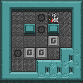

.. _doc_getting_started_gdy:

########################
Griddly Description YAML
########################

Griddly Description YAML (GDY) is is the description language the Griddly uses to create environments and configure how to control the objects within it.

GDY files are typically split into 3 parts:

* **Environment** - Define levels, players, action mappings..
* **Actions** - Define the game mechanics
* **Objects** - Define the different objects in the environment and their properties

A GDY file looks like this:

.. code-block:: YAML

    Version: "0.1"
    Environment:
      Name: sokoban
      Observers:
        Sprite2D:
          TileSize: 24
          BackgroundTile: gvgai/newset/floor2.png
      Player:
        Count: 1 # This is only a single player game
        AvatarObject: avatar # The player can only control a single avatar in the game
      Termination:
        Win:
          - eq: [box:count, 0] # If there are no boxes left
      Levels:
        - |
          wwwwwww
          w..hA.w
          w.whw.w
          w...b.w
          whbb.ww
          w..wwww
          wwwwwww
        - |
          wwwwwwwww
          ww.h....w
          ww...bA.w
          w....w..w
          wwwbw...w
          www...w.w
          wwwh....w
          wwwwwwwww

    Actions:
    # Define the move action
    - Name: move
      Behaviours:
        # The agent can move around freely in empty space and over holes
        - Src:
            Object: avatar
            Commands:
              - mov: _dest
          Dst:
            Object: [_empty, hole]
        
        # Boxes can move into empty space
        - Src:
            Object: box
            Commands:
                - mov: _dest
          Dst:
            Object: _empty

        # The agent can push boxes
        - Src:
            Object: avatar
            Commands:
              - mov: _dest
          Dst:
            Object: box
            Commands:
              - cascade: _dest

        # If a box is moved into a hole remove it
        - Src:
            Object: box
            Commands:
              - remove: true
              - reward: 1
          Dst:
            Object: hole

    Objects:
    - Name: box
      Z: 2
      MapCharacter: b
      Observers:
        Sprite2D:
          - Image: gvgai/newset/block1.png

    - Name: wall
      MapCharacter: w
      Observers:
        Sprite2D:
          - TilingMode: 
              WALL_16
            Image:
              - gvgai/oryx/wall3_0.png
              - gvgai/oryx/wall3_1.png
              - gvgai/oryx/wall3_2.png
              - gvgai/oryx/wall3_3.png
              - gvgai/oryx/wall3_4.png
              - gvgai/oryx/wall3_5.png
              - gvgai/oryx/wall3_6.png
              - gvgai/oryx/wall3_7.png
              - gvgai/oryx/wall3_8.png
              - gvgai/oryx/wall3_9.png
              - gvgai/oryx/wall3_10.png
              - gvgai/oryx/wall3_11.png
              - gvgai/oryx/wall3_12.png
              - gvgai/oryx/wall3_13.png
              - gvgai/oryx/wall3_14.png
              - gvgai/oryx/wall3_15.png

    - Name: hole
      Z: 1
      MapCharacter: h
      Observers:
        Sprite2D:
        - Image: gvgai/oryx/cspell4.png

    - Name: avatar
      Z: 2
      MapCharacter: A
      Observers:
        Sprite2D:
        - Image: gvgai/oryx/knight1.png

This is all thats needed to define a game of Sokoban that has two levels which look like this:

.. image:: img/getting-started-level-1.png

**********
GDY Schema
**********

To make GDY slightly less scary, there is a GDY json schema which can be integrated with most IDEs to help write GDY files.

You can :ref:`Find the tutorial here <doc_tutorials_gdy_schema>`

