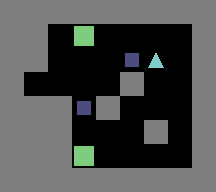

.. _doc_getting_started_gym:

OpenAI Gym Interface
====================

Games defined with :ref:`GDY <doc_getting_started_gdy>` files can easily be wrapped by OpenAI's gym interface.

Games are currently not automatically imported into the OpenAI wrapper wehn the python libraries are loaded. 
The reason for this is that Griddly environments allow you to specify many parameters for generated environments.

To use the OpenAI Gym wrapper there you must first define the game and observers you wish to use.

.. code-block:: python

    import os
    import sys

    import gym
    from griddly import GymWrapperFactory, gd

    if __name__ == '__main__':
        wrapper = GymWrapperFactory()

        environment_name = 'sokoban'
        level = 2

        wrapper.build_gym_from_yaml(environment_name, f'single-player/{environment_name}.yaml', player_observer_type=gd.ObserverType.SPRITE_2D, level=level)

        env = gym.make(f'GDY-{environment_name}-v0')

------------

Lets break this down a bit:

.. code-block:: python

    wrapper = GymWrapperFactory()

The wrapper factory is a utility provided by griddly that wraps the native Griddly environment in an OpenAI gym interface. This is always required to create gym environments.

------------

.. code-block:: python

    environment_name = 'sokoban'
    level = 2

We first define some variables.. the filename of the environment we want to load and the particular level in that environment.
In this case we are going to load the game sokoban and the second level that is defined for sokoban

------------

.. code-block:: python 

    wrapper.build_gym_from_yaml(environment_name, f'single-player/{environment_name}.yaml', player_observer_type=gd.ObserverType.SPRITE_2D, level=level)

This command builds and loads the gym environment with the information supplied. This particular command will load the mechanics of the sokoban environment and the second level defined in the GDY file. 
States will be generated by the SPRITE_2D observer.

------------

.. code-block:: python 

    env = gym.make(f'GDY-{environment_name}-v0')

This is the familiar gym make command that create the env reference. This can now be used as you would use any other gym environment.

Observer Types
---------------

In Griddly when generating an environment you can specify how you want the environment to be rendered. You can do this by telling the ``build_gym_from_yaml`` function which observer type to use.

There are three supported observer types in Griddly:

.. note:: for SPRITE_2D and BLOCK_2D observers, each object must define how it should be rendered with an :ref:`Observer Configuration <#/properties/Objects/items/properties/Observers>`

gd.ObserverType.SPRITE_2D
^^^^^^^^^^^^^^^^^^^^^^^^^

Renders sprites defined by the GDY object `Sprite2D` descriptions.

.. image:: img/sprite2D.png

gd.ObserverType.BLOCK_2D
^^^^^^^^^^^^^^^^^^^^^^^^^

Renders sprites defined by the GDY object `Block2D` descriptions.

If the `player_observer_type` argument is set to `player_observer_type=gd.ObserverType.BLOCK_2D` you should see this:

gd.ObserverType.VECTOR
^^^^^^^^^^^^^^^^^^^^^^

The vector observer is the fastest observer type in Griddly. It can reach tens of thousands of states per second.

Vector observers will return a tensor of shape [*objects*, *width*, *height*] where each value is either 0 or 1 denoting that there is an object of that type in a particular location. 

The Global Observer
-------------------

The global observer can be used alongside any of the other observers and will always render the entire environment regardless of how other observers are defined.
This means that you can pass vector observers to your agents and then render with sprites or blocks to make awesome demos!

.. code-block:: python

    wrapper.build_gym_from_yaml(environment_name, f'single-player/{environment_name}.yaml', global_observer_type=gd.ObserverType.SPRITE_2D, player_observer_type=gd.ObserverType.VECTOR, level=level)

    env = gym.make(f'GDY-{environment_name}-v0')

    env.render(observer='global')