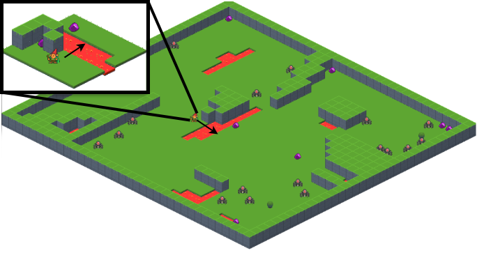
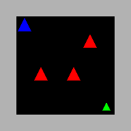
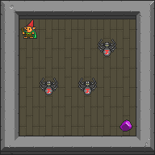
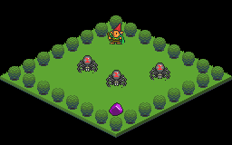

.. _doc_observation_spaces:

##################
Observation Spaces
##################

********
Overview
********

Observation spaces in Griddly are highly configurable. In addition to providing pixel-based and vector-based states of environments, Griddly also provides methods of accessing semantic information about the game state itself, such as state data and event history. For pixel and vector-based representations Griddly provides different **observers**.

What is an **Observer**?
========================

An **observer** in Griddly converts the state of an environment to something that is consumable by a machine learning algorithm. It effectively `creates` the observations. In Griddly there are many different options for creating observations. This page will outline how all of these methods can be used.

Every environment in Griddly has at least two configurable observers; the **player** observer(s) and the **global** observer.

   
  The "Spider Nest" environment with an isometric player observer (inset) and isometric global observer configured.

The **player** observer(s) are what the agent in the environment `sees`. The agent might be able to see only a small area around itself (this is known as egocentric partial observability), or it might be able to see the entire environment.

The **global** observer always gives a view of the entire environment regardless of the number of players and and size of the environment.

Both observers have a standard OpenAI Gym observation space which can be accessed with ``env.observation_space`` describing the player observation space and ``env.global_observation_space`` describing the global observation space.

Single Agent Observations
=========================

The observations for environments where a single avatar is being controlled are returned in the following way:

.. code-block:: python
  
  obs = env.reset()

  # obs = np.array([ ... ]) # Player observation

  obs, reward, done, info = env.step( ... )

  # obs = np.array([ ... ]) # Player observation

Multi-Agent Observations
========================

When there are multiple agents in an environment the ``env.reset(...)`` and ``env.step(...)`` functions will return the observations of all the of agents as an array of ``np.array`` objects. Each observation in the array will be consistent with the shape of ``env.observation_shape``.

As an example in an environment with 2 players, the result of ``env.reset(...)`` and ``env.step(...)`` will be:

.. code-block:: python
  
  obs = env.reset()

  #  obs = [
  #    np.array([ ... ]), # Player 1 observation
  #    np.array([ ... ]) # Player 2 observation
  # ]

  obs, reward, done, info = env.step([ ... ])

  #  obs = [
  #    np.array([ ... ]), # Player 1 observation
  #    np.array([ ... ]) # Player 2 observation
  # ]

The global observer can also be returned in the ``env.reset()`` function by setting the ``global_observations`` parameter to ``True``. In this case a dictionary is returned with the ``global`` and ``player`` keys for both observation types.

.. code-block:: python
  
  obs = env.reset(global_observations=True)

  #  obs = {
  #      'global': np.array([ ... ]), # Global observation
  #      'player': [
  #        np.array([ ... ]), # Player 1 observation
  #        np.array([ ... ]) # Player 2 observation
  #     ]
  # }

******
Pixels
******

.. note:: For pixel-based observers, each object must define how it should be rendered with an :ref:`Observer Configuration <#/properties/Objects/items/properties/Observers>`

The observer type can be chosen when creating the environment with ``gym.make()``

.. code-block:: python
  
  env = gym.make(
    'GDY-MyEnvironmentName-v0',
    player_observer_type=XXX,
    global_observer_type=YYY
    ...
  )

The options for both the ``player_observer_type`` and ``global_observer_type`` are given below.

:gd.ObserverType.BLOCK_2D:
  Renders sprites defined by the GDY object `Block2D` descriptions.

:gd.ObserverType.SPRITE_2D:
  Renders sprites defined by the GDY object `Sprite2D` descriptions.

:gd.ObserverType.ISOMETRIC:
  Renders sprites defined by the GDY object `Isometric` descriptions.

.. _vector_observer:

******
Vector
******

Vector observers will return a tensor of shape [*objects, player ids, object_rotation, variables*, *width*, *height*] where each value is either 0 or 1 denoting that there is an object of that type in a particular location. 

The data contained in the cell can be configured using the vector options in the :ref:`GDY observer configuration <#/properties/Environment/properties/Observers/properties/Vector>`.

:Objects:

Each cell always contains a multi-label representation of whether an object is present (1) in that cell or not (0).

The order of the object index in each [x,y] location can be retrieved by calling ``env.game.get_object_names()``. 

:IncludePlayerId:
  If this option is set, each cell of the observation tensor also contains a one-hot representation of which player an object belongs to.

.. warning:: In multi-agent scenarios, every agent sees themselves as player 1.

:IncludeRotation:
  This option appends a one-hot to the cell representing the rotation of the object at that position.

:IncludeVariables:
  If set, the local variables of each object are provided. The order of the variables can be retrieved by calling ``env.game.get_object_variable_names()``

As an example, in an 5x5 environment that has three types of object: `avatar`, `wall` and `goal` and no other options are set:

.. code-block:: python

  obs_shape = env.observation_space.shape

  # obs_shape == (3,5,5)

  obs, reward, done, info = env.step( ... )

  # obs = [
    [ # avatar in these locations
      [0,0,0,0,0],
      [0,1,0,0,0],
      [0,0,0,0,0],
      [0,0,0,0,0],
      [0,0,0,0,0]
    ],
    [ # wall in these locations
      [1,1,1,1,1],
      [1,0,0,0,1],
      [1,0,0,0,1],
      [1,0,0,0,1],
      [1,1,1,1,1]
    ],
    [ # goal in these locations
      [0,0,0,0,0],
      [0,0,0,0,0],
      [0,0,0,0,0],
      [0,0,0,1,0],
      [0,0,0,0,0]
    ]
  ]

**************
Semantic State 
**************

A breakdown of the entire environment including internal variable values that the objects may have can be recovered using ``env.get_state()``.

:env.get_state():
  This function will return data in the following format:

  .. code-block:: javascript

    {
      'GameTicks': 1, 
      'GlobalVariables': {}, 
      'Objects': [
        {
          'Name': 'avatar', 
          'Location': [1, 3], 
          'Orientation': 'NONE', 
          'PlayerId': 1, 
          'Variables': {
            '_y': 3, 
            '_playerId': 1, 
            '_x': 1
          }
        },
        {
          'Name': 'goal', 
          'Location': [1, 3], 
          'Orientation': 'NONE', 
          'PlayerId': 1, 
          'Variables': {
            '_y': 3, 
            '_playerId': 1, 
            '_x': 1
          }
        },
        {

          ...
        
        }
      ]
    }

*************
Event History 
*************

Event history in Griddly contains all the information about actions that have been made by the player, any internal actions that have been executed by any game mechanics, or any delayed actions that have been performed.

Event history is gathered during ``env.step()`` and returned in the ``info['History']`` variable, but it must be enabled first.

To enable event history, ``env.enable_history(True)`` can be called after ``gym.make()``

The format of event history looks like this:

.. code-block:: javascript

  [
    {
      'PlayerId': 1,
      'ActionName': 'move',
      'Tick': 0,
      'Reward': 0,
      'Delay': 0,
      'SourceObjectName': 'avatar',
      'DestinationObjectName': '_empty',
      'SourceObjectPlayerId': 1,
      'DestinationObjectPlayerId': 0,
      'SourceLocation': [2.0, 3.0],
      'DestinationLocation': [1.0, 3.0]
    },
    {
      'PlayerId': 1,
      'ActionName': 'move',
      'Tick': 0,
      'Reward': 0,
      'Delay': 0,
      'SourceObjectName': 'ball',
      'DestinationObjectName': '_empty',
      'SourceObjectPlayerId': 1,
      'DestinationObjectPlayerId': 0,
      'SourceLocation': [1.0, 3.0],
      'DestinationLocation': [0.0, 3.0]
    },
    ...
  ]

