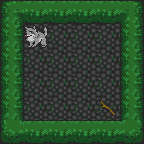
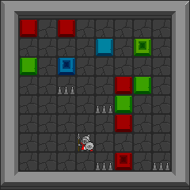

.. _doc_tutorials_pcg:

#############################
Procedural Content Generation
#############################

Reinforcement learning can be prone to over-fitting in environments where the initial conditions are limited and the environment dynamics are deterministic.
Procedural content generation is an important tool in Reinforcement learning, as it allows level maps to be created on-the-fly. This gives the agent a much more complex challenge, and stops it from being able to overfit on a small dataset of levels.

**********
Level Maps
**********

Levels in Griddly environments are defined by strings of characters. The ``MapCharacter`` used are defined in the GDY files of the game. These ``MapCharacter`` can be found in the GDY files or in the game's documentation.

Basic Map
=========

.. code-block:: python

    W  W  W  W  W  W
    W  A  .  .  .  W
    W  .  .  .  .  W
    W  .  .  .  .  W
    W  .  .  .  g  W
    W  W  W  W  W  W

    How the above Doggo level is rendered.

You can see in this map example above that the ``A`` character defines the Dog and the ``g`` character defines the goal. ``W`` defines the walls and ``.`` is reserved for empty space.

This is a basic example and generating levels for this environment might not be too interesting...

************************
Clusters Level Generator
************************

A much more complicated example would be to use the `Clusters<doc_clusters>` game and generate new levels. The aim of the Clusters game is for the agent to push coloured blocks together to form "clusters", whilst avoiding spikes.
The game is fully deterministic and there are only 5 levels supplied in the original GDY file. This makes it a perfect candidate for building new levels and testing if Reinforcement Learning can still solve these levels!

Level Generator Class
=====================

Here's an example of a level generator for the cluster's game. 

The ``LevelGenerator`` class can be used as a base class. Only the ``generate`` function needs to be implemented.

.. code-block:: python

    class ClustersLevelGenerator(LevelGenerator):
        BLUE_BLOCK = 'a'
        BLUE_BOX = '1'
        RED_BLOCK = 'b'
        RED_BOX = '2'
        GREEN_BLOCK = 'c'
        GREEN_BOX = '3'

        AGENT = 'A'

        WALL = 'w'
        SPIKES = 'h'

        def __init__(self, config):
            super().__init__(config)
            self._width = config.get('width', 10)
            self._height = config.get('height', 10)
            self._p_red = config.get('p_red', 1.0)
            self._p_green = config.get('p_green', 1.0)
            self._p_blue = config.get('p_blue', 1.0)
            self._m_red = config.get('m_red', 5)
            self._m_blue = config.get('m_blue', 5)
            self._m_green = config.get('m_green', 5)
            self._m_spike = config.get('m_spike', 5)

        def _place_walls(self, map):

            # top/bottom wall
            wall_y = np.array([0, self._height - 1])
            map[:, wall_y] = ClustersLevelGenerator.WALL

            # left/right wall
            wall_x = np.array([0, self._width - 1])
            map[wall_x, :] = ClustersLevelGenerator.WALL

            return map

        def _place_blocks_and_boxes(self, map, possible_locations, p, block_char, box_char, max_boxes):
            if np.random.random() < p:
                block_location_idx = np.random.choice(len(possible_locations))
                block_location = possible_locations[block_location_idx]
                del possible_locations[block_location_idx]
                map[block_location[0], block_location[1]] = block_char

                num_boxes = 1 + np.random.choice(max_boxes - 1)
                for k in range(num_boxes):
                    box_location_idx = np.random.choice(len(possible_locations))
                    box_location = possible_locations[box_location_idx]
                    del possible_locations[box_location_idx]
                    map[box_location[0], box_location[1]] = box_char

            return map, possible_locations

        def generate(self):
            map = np.chararray((self._width, self._height), itemsize=2)
            map[:] = '.'

            # Generate walls
            map = self._place_walls(map)

            # all possible locations
            possible_locations = []
            for w in range(1, self._width - 1):
                for h in range(1, self._height - 1):
                    possible_locations.append([w, h])

            # Place Red
            map, possible_locations = self._place_blocks_and_boxes(
                map,
                possible_locations,
                self._p_red,
                ClustersLevelGenerator.RED_BLOCK,
                ClustersLevelGenerator.RED_BOX,
                self._m_red
            )

            # Place Blue
            map, possible_locations = self._place_blocks_and_boxes(
                map,
                possible_locations,
                self._p_blue,
                ClustersLevelGenerator.BLUE_BLOCK,
                ClustersLevelGenerator.BLUE_BOX,
                self._m_blue
            )

            # Place Green
            map, possible_locations = self._place_blocks_and_boxes(
                map,
                possible_locations,
                self._p_green,
                ClustersLevelGenerator.GREEN_BLOCK,
                ClustersLevelGenerator.GREEN_BOX,
                self._m_green
            )

            # Place Spikes
            num_spikes = np.random.choice(self._m_spike)
            for k in range(num_spikes):
                spike_location_idx = np.random.choice(len(possible_locations))
                spike_location = possible_locations[spike_location_idx]
                del possible_locations[spike_location_idx]
                map[spike_location[0], spike_location[1]] = ClustersLevelGenerator.SPIKES

            # Place Agent
            agent_location_idx = np.random.choice(len(possible_locations))
            agent_location = possible_locations[agent_location_idx]
            map[agent_location[0], agent_location[1]] = ClustersLevelGenerator.AGENT

            level_string = ''
            for h in range(0, self._height):
                for w in range(0, self._width):
                    level_string += map[w, h].decode().ljust(4)
                level_string += '\n'

            return level_string

This generates levels like the following:

    
    A 10x10 map generated by the above code.

Using ``LevelGenerator`` 
========================

In the most simple case, the level generator can be used just before the level resets and the generated string can be passed to ``env.reset(level_string=...)``

.. code-block:: python

    if __name__ == '__main__':

        config = {
            'width': 10,
            'height': 10
        }

        renderer = RenderToFile()

        level_generator = ClustersLevelGenerator(config)

        env = gym.make('GDY-Clusters-v0')
        env.reset(level_string=level_generator.generate())

        ...

Using ``LevelGenerators`` with RLLib
====================================

The ``LevelGenerator`` base class is compatible with RLLib and can be used and configured through the standard RLLib configuration.

For example, the level generator and its parameters can be set up in the ``env_config`` in the following way:

.. code-block:: python
    
    'config': {

        ...
        
        'env_config': {
            'generate_valid_action_trees': True,
            'level_generator': {
                'class': ClustersLevelGenerator,
                'config': {
                    'width': 6,
                    'height': 6,
                    'p_red': 0.7,
                    'p_green': 0.7,
                    'p_blue': 0.7,
                    'm_red': 4,
                    'm_blue': 4,
                    'm_green': 4,
                    'm_spike': 4
                }
        },

        ...
    }

