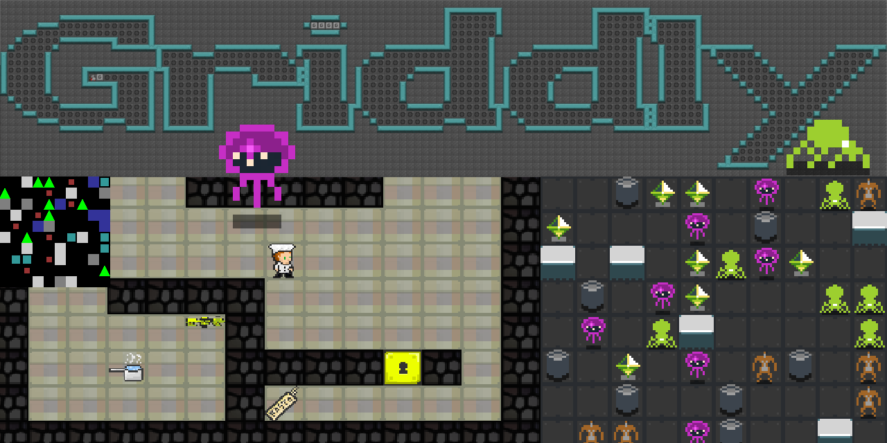

.. Griddly documentation master file, created by
   sphinx-quickstart on Tue Jun  2 07:56:30 2020.
   You can adapt this file completely to your liking, but it should at least
   contain the root `toctree` directive.

Griddly Docs
============

Griddly documentation.

.. toctree::
   :maxdepth: 1
   :caption: About
   :name: sec-general

   about/introduction
   about/community
   about/halloffame
   about/artwork
   about/faq

.. toctree::
   :maxdepth: 2
   :caption: Getting Started
   :name: sec-getting-started

   getting-started/installation/index
   getting-started/gym/index
   getting-started/gdy/index
   getting-started/action spaces/index
   getting-started/observation spaces/index
   getting-started/visualization/index
   getting-started/procedural content generation/index

.. toctree::
   :maxdepth: 2
   :caption: Games
   :name: sec-games

   games/index

.. toctree::
   :maxdepth: 3
   :caption: Reinforcement learning
   :name: sec-rllib

   rllib/intro/index
   rllib/single-agent/index
   rllib/multi-agent/index
   rllib/rts/index

.. toctree::
   :maxdepth: 10
   :caption: Tutorials
   :name: sec-tutorials

   tutorials/GDY/index
   tutorials/GDY Schema/index

.. toctree::
   :maxdepth: 10
   :caption: Reference
   :name: sec-reference

   reference/GDY/index