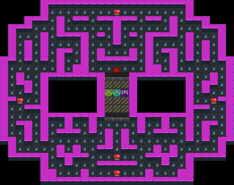

.. _doc_rllib_multi_agent:

###########
Multi Agent
###########

Griddly automatically wraps multi-agent games for compatibility with RLLib using the `RLLibMultiAgentWrapper`.

To register the multi-agent Griddly environment for usage with RLLib, the environment can be wrapped in the following way:

.. code-block:: python

    # Create the environment and wrap it in a multi-agent wrapper for self-play
    register_env(environment_name, lambda config: RLlibMultiAgentWrapper(RLlibEnv(config)))

***********************
Handling agent ``done``
***********************

If a multi-agent environment has the conditions in which agents in the environment can be removed, for example they are defeated and are not longer in the episode, a RLLib needs to know that this agent no longer can receive actions.

Griddly's ``RLlibMultiAgentWrapper`` handles this by detecting a ``player_done_variable``, defined per-player in the GDY. When this variable is set to ``1`` for a player, RLLib will consider this player has been removed.

************
Full Example
************

In this example we use a multi-agent version of the "GridMan" environment, but we train both "Gridman" and the agents that are chasing him!

Gridman has a 9x9 observation space and the chasers only have a 7x7 observation space, which gives them a disadvantage. However there are three of them!

   
  The GridMan environment as seen from the "Global Observer" view.

.. seealso:: To use a different game, or specific level, just change the ``yaml_file`` or set a ``level`` parameter in the ``env_config``. Other options can be found :ref:`here <doc_rllib_intro>`

.. code-block:: python

    import os
    import sys

    import gym
    from griddly.util.rllib.callbacks import VideoCallbacks
    from griddly.util.rllib.environment.core import RLlibEnv, RLlibMultiAgentWrapper
    from ray.air.callbacks.wandb import WandbLoggerCallback
    from ray.rllib.algorithms.ppo import PPOConfig
    from ray.rllib.models import ModelCatalog
    from ray.rllib.policy.policy import PolicySpec
    from ray.tune import register_env, tune

    from rllib_multi_agent_example.gap_agent import GAPAgent
    from rllib_multi_agent_example.simple_conv_agent import SimpleConvAgent

    # You have to put this here so that rllib can find griddly libraries when it starts new workers
    sep = os.pathsep
    os.environ["PYTHONPATH"] = sep.join(sys.path)

    environment_name = "GridmanMultiAgent"
    environment_yaml = "gridman/gridman_multiagent.yaml"
    model_name = "SimpleConvAgent"

    # Register the environment with RLlib
    register_env(environment_name, lambda config: RLlibMultiAgentWrapper(RLlibEnv(config)))

    model_class = None
    if model_name == "SimpleConvAgent":
        model_class = SimpleConvAgent
    elif model_name == "GlobalAveragePoolingAgent":
        model_class = GAPAgent

    # Register the model with RLlib
    ModelCatalog.register_custom_model(model_name, model_class)

    test_dir = f"./results/{environment_name}"
    video_dir = f"videos"

    # multi-agent policies
    policies = {
        # Use the PolicySpec namedtuple to specify an individual policy:
        "gridman_policy": PolicySpec(
            observation_space=gym.spaces.Box(0, 255, (9, 9, 11), float),
            config={"gamma": 0.95},
        ),
        "enemy_policy": PolicySpec(
            observation_space=gym.spaces.Box(0, 255, (7, 7, 11), float),
            config={"gamma": 0.95},
        ),
    }

    def policy_mapping_fn(agent_id, episode, worker, **kwargs):
        if agent_id == 1:
            return "gridman_policy"
        else:
            return "enemy_policy"

    config = (
        PPOConfig()
        .rollouts(num_rollout_workers=8, num_envs_per_worker=16, rollout_fragment_length=128)
        .callbacks(VideoCallbacks)
        .multi_agent(policies=policies, policy_mapping_fn=policy_mapping_fn)
        .training(
            model={
                "custom_model": model_name
            },
            train_batch_size=16384,
            lr=1e-4,
            gamma=0.95,
            lambda_=0.9,
            use_gae=True,
            clip_param=0.4,
            grad_clip=None,
            entropy_coeff=0.1,
            vf_loss_coeff=0.5,
            sgd_minibatch_size=2048,
            num_sgd_iter=4,
        )
        .environment(
            env_config={
                # A video every 50 iterations
                'record_video_config': {
                    'fps': 20,
                    'frequency': 1000,
                    'directory': video_dir,

                    # Will record a video of the global observations
                    'include_global': True,

                    # Will record a video of the agent's perspective
                    'include_agents': False,
                },
                'random_level_on_reset': True,
                'yaml_file': environment_yaml,
                'global_observer_type': "GlobalSpriteObserver",
                'player_observer_type': ["VectorGridMan", "VectorEnemy", "VectorEnemy", "VectorEnemy"],
                'max_steps': 2000,
            },
            env=environment_name, clip_actions=True)
        .debugging(log_level="ERROR")
        .framework(framework="torch")
        .resources(num_gpus=int(os.environ.get("RLLIB_NUM_GPUS", "1")))
    )

    result = tune.run(
        "PPO",
        name="PPO",
        stop={"timesteps_total": 10000000},
        local_dir=test_dir,
        config=config.to_dict(),
        callbacks=[
            WandbLoggerCallback(project="RLLib Gridman MultiAgent", entity="griddlyai")
        ]
    )

******************
Github Repository
******************

You can find a full working example here: https://github.com/GriddlyAI/rllib_multi_agent_self_play_example