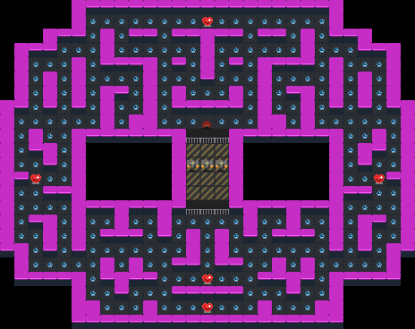

.. _doc_rllib_single_agent:

###################
Single Agent Games
###################

The Griddly RLLibEnv wrapper allows any of the single-agent games to be trained with many of the single agent RLLib Algorithms.

.. code-block:: python

    register_env('my-single-agent-environment', RLlibEnv)

************
Full Example
************

The example below uses PPO to train on the "GridMan" Environment.

The agent in the "GridMan" environment has a 7x7 partially observable ego-centric view.

By default the agent sees a :ref:`VECTOR <vector_observer>` view of the environment. This view is passed to a :ref:`Simple Conv Agent <simple_conv_agent>` to produce the policy.

.. seealso:: To use a different game, or specific level, just change the ``yaml_file`` or set a ``level`` parameter in the ``env_config``. Other options can be found :ref:`here <doc_rllib_intro>`

   
  The GridMan environment as seen from the "Global Observer" view.

.. code-block:: python

    import os
    import sys

    from griddly.util.rllib.callbacks import VideoCallbacks
    from griddly.util.rllib.environment.core import RLlibEnv
    from ray.air.callbacks.wandb import WandbLoggerCallback
    from ray.rllib.algorithms.ppo import PPOConfig
    from ray.rllib.models import ModelCatalog
    from ray.tune import register_env, tune

    from rllib_single_agent_example.gap_agent import GAPAgent
    from rllib_single_agent_example.simple_conv_agent import SimpleConvAgent

    # You have to put this here so that rllib can find griddly libraries when it starts new workers
    sep = os.pathsep
    os.environ["PYTHONPATH"] = sep.join(sys.path)

    environment_name = "GridMan"
    environment_yaml = "gridman/gridman.yaml"
    model_name = "SimpleConvAgent"

    # Register the environment with RLlib
    register_env(environment_name, lambda config: RLlibEnv(config))

    model_class = None
    if model_name == "SimpleConvAgent":
        model_class = SimpleConvAgent
    elif model_name == "GlobalAveragePoolingAgent":
        model_class = GAPAgent

    # Register the model with RLlib
    ModelCatalog.register_custom_model(model_name, model_class)

    test_dir = f"./results/{environment_name}"
    video_dir = f"videos"

    config = (
        PPOConfig()
        .rollouts(num_rollout_workers=8, num_envs_per_worker=16, rollout_fragment_length=128)
        .callbacks(VideoCallbacks)
        .training(
            model={
                "custom_model": model_name
            },
            train_batch_size=16384,
            lr=1e-4,
            gamma=0.95,
            lambda_=0.9,
            use_gae=True,
            clip_param=0.4,
            grad_clip=None,
            entropy_coeff=0.1,
            vf_loss_coeff=0.5,
            sgd_minibatch_size=2048,
            num_sgd_iter=4,
        )
        .environment(
            env_config={
                # A video every 50 iterations
                'record_video_config': {
                    'frequency': 1000,
                    'directory': video_dir,

                    # Will record a video of the global observations
                    'include_global': True,

                    # Will record a video of the agent's perspective
                    'include_agents': False,
                },
                'random_level_on_reset': True,
                'yaml_file': environment_yaml,
                'global_observer_type': "GlobalSpriteObserver",
                'player_observer_type': "Vector",
                'max_steps': 2000,
            },
            env=environment_name, clip_actions=True)
        .debugging(log_level="ERROR")
        .framework(framework="torch")
        .resources(num_gpus=int(os.environ.get("RLLIB_NUM_GPUS", "1")))
    )

    result = tune.run(
        "PPO",
        name="PPO",
        stop={"timesteps_total": 10000000},
        local_dir=test_dir,
        config=config.to_dict(),
        callbacks=[
            WandbLoggerCallback(project="RLLib Gridman", group="griddlyai")
        ]
    )

******************
Github Repository
******************

You can find a full working example here: https://github.com/GriddlyAI/rllib_single_agent_example