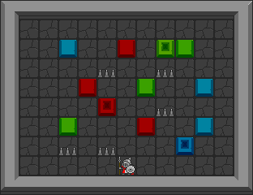

.. _doc_rllib_single_agent:

###################
Single Agent Games
###################

The Griddly RLLibEnv wrapper allows any of the single-agent games to be trained with many of the single agent RLLib Algorithms.

.. code-block:: python

    register_env('my-single-agent-environment', RLlibEnv)

The example below uses IMPALA to train on the :ref:`Partially Observable Clusters <doc_partially_observable_clusters>` Environment.

The agent in the :ref:`Partially Observable Clusters <doc_partially_observable_clusters>` environment has a 5x5 partially observable ego-centric view.

By default the agent sees a :ref:`VECTOR <vector_observer>` view of the environment. This view is passed to a :ref:`Global Average Pooling Agent <gap_agent>` to produce the policy.

   
  The Clusters environment as seen from the "Global Observer" view.

************
Full Example
************

.. code-block:: python

    import os
    import sys

    import ray
    from ray import tune
    from ray.rllib.agents.impala import ImpalaTrainer
    from ray.rllib.models import ModelCatalog
    from ray.tune.registry import register_env

    from griddly import gd
    from griddly.util.rllib.torch import GAPAgent
    from griddly.util.rllib.wrappers.core import RLlibEnv

    if __name__ == '__main__':

        ray.init(num_gpus=1)

        env_name = "ray-griddly-env"

        register_env(env_name, RLlibEnv)
        ModelCatalog.register_custom_model("GAP", GAPAgent)

        max_training_steps = 100000000

        config = {
            'framework': 'torch',
            'num_workers': 8,
            'num_envs_per_worker': 4,

            'model': {
                'custom_model': 'GAP',
                'custom_model_config': {}
            },
            'env': env_name,
            'env_config': {
                'record_video_config': {
                    'frequency': 100000
                },

                'random_level_on_reset': True,
                'yaml_file': 'Single-Player/GVGAI/clusters_partially_observable.yaml',
                'global_observer_type': gd.ObserverType.SPRITE_2D,
                'max_steps': 1000,
            },
            'entropy_coeff_schedule': [
                [0, 0.01],
                [max_training_steps, 0.0]
            ],
            'lr_schedule': [
                [0, 0.0005],
                [max_training_steps, 0.0]
            ]
        }

        stop = {
            "timesteps_total": max_training_steps,
        }

        result = tune.run(ImpalaTrainer, config=config, stop=stop)
