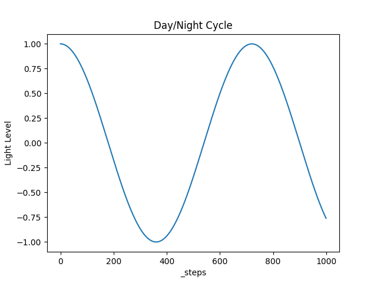
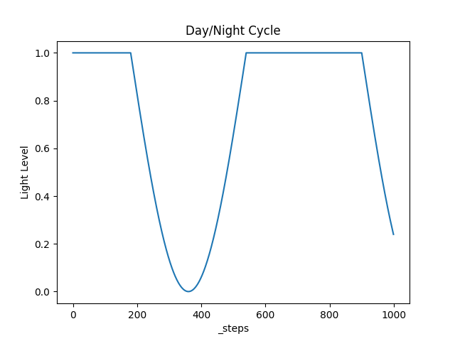

.. _doc_tutorials_custom_shaders_global_lighting:

###############
Global Lighting
###############

In this tutorial we modify the :ref:`Bufferflies <doc_butterflies_and_spiders>` environment to have a day/night cycle. In environments that use pixel-based observations this can provide an additional challenge to agents, as the agent has to encode the pixel representations of the envrionment in a way that allows for many different lighting levels.

.. raw:: html

  

      <video onloadeddata="this.play();" playsinline loop muted height="10%">

          <source src="../../../_static/video/tutorials/custom_shaders/global_lighting/global_video_test.mp4"
                  type="video/mp4">

          Sorry, your browser doesn't support embedded videos.
      </video>
      
<a class="headerlink" href="#vid1">¶</a>

  

*********************
Naive Day/Night Cycle 
*********************

We want the value of the pixels to cycle from black (night) to their *actual* (daylight) values. We can do this by multiplying the RGB values by a **light level** value :math:`L` that oscillates (with respect to ``_steps`` :math:`s`) between 0 and 1.

We could just use:

.. math:: L = \cos \left(\frac{\pi s}{360}\right)

but this would mean that we would only reach full daylight and complete darkness once every 360 steps. What we actually want is light for maybe 50% of the time and then a short-ish night. 

For this we can use:

.. math:: L = \min(1 ,\cos \left(\frac{\pi s}{360} \right)+1)

Now we have an algorithm for calculating the light level coefficient, how do we apply this in our custom shaders?

*********************************
Using global variables in shaders
*********************************

To implement our day/night cycle using our :math:`L` value, we first have to understand a few features that are available in the Griddly engine.

How does Griddly handle "time"?
===============================

Griddly has a built-in step counter called ``_steps`` which can be accessed as a global variable. This value is equal to the number of steps that have passed in a particular episode.

How can we pass the ``_steps`` parameter to the shader?
=======================================================

The ``_steps`` parameter is automatically passed to the shader by default. Other global variables can be passed to the shader by specifying it in the GDY :ref:`Shader options <#/properties/Environment/properties/Observers/properties/Sprite2D/properties/Shader>`. An example of this is shown below. 

.. code:: yaml

  Observers:
    Sprite2D:
      Shader:
      # The _steps variable is automatically exported to all shaders, so we cannot add it here,
      # but this is how we would add custom global variables
        GlobalVariables: [global_variable1, global_variable2]

How can we read the ``_steps`` parameter and use it?
====================================================

Global variables specified in the ``Shader`` configuration of the GDY file, are sent to the shader in the same order that they are specified in the GDY. However the ``_steps`` variable is also included by default in position ``0``.

In the shader, we can use the ``GlobalVariable`` uniform buffer:

.. code:: glsl

  layout(std430, binding = 4) readonly buffer GlobalVariableBuffer {
    GlobalVariable variables[];
  }
  globalVariableBuffer;

  # globalVariableBuffer.variables[0] # this is the value of _steps

Now we know how to access the variable in the shader, how can we customize the shaders to modify the pixel values to what we want?

.. note:: more information on compiling custom shaders and using them in Griddly envs can be found :ref:`here <customizing_shaders>`

***********************
Global Lighting Shaders
***********************

Vertex
======

Most of the code in the vertex shader is standard code required for drawing the observation. 

We calculate the lighting level in the vertex shader (so we don't need to calculate it for every pixel) and pass it to the fragment shader using ``outLightLevel`` 

.. code:: glsl

  #version 460

  layout(location = 0) in vec3 inPosition;
  layout(location = 1) in vec2 inFragTextureCoords;

  layout(location = 0) out vec4 outLightLevel;
  layout(location = 1) out vec3 outFragTextureCoords;

  out gl_PerVertex {
    vec4 gl_Position;
  };

  struct GlobalVariable {
    int value;
  };

  struct ObjectVariable {
    int value;
  };

  struct PlayerInfo {
    vec4 playerColor;
    vec4 playerObservableGrid;
  };

  struct ObjectData {
    mat4 modelMatrix;
    vec4 color;
    vec4 gridPosition;
    vec2 textureMultiply;
    int textureIndex;
    int objectType;
    int playerId;
  };

  layout(std140, binding = 1) uniform EnvironmentData {
    mat4 projectionMatrix;
    mat4 viewMatrix;
    vec2 gridDims;
    int playerCount;
    int playerId;
    int globalVariableCount;
    int objectVariableCount;
    int globalObserverAvatarMode;
    int highlightPlayers;
  }
  environmentData;

  layout(std430, binding = 2) readonly buffer PlayerInfoBuffer {
    PlayerInfo variables[];
  }
  playerInfoBuffer;

  layout(std430, binding = 3) readonly buffer ObjectDataBuffer {
    uint size;
    ObjectData variables[];
  }
  objectDataBuffer;

  layout(std430, binding = 4) readonly buffer GlobalVariableBuffer {
    GlobalVariable variables[];
  }
  globalVariableBuffer;

  layout(std430, binding = 5) readonly buffer ObjectVariableBuffer {
    ObjectVariable variables[];
  }
  objectVariableBuffer;

  layout(push_constant) uniform PushConsts {
    int idx;
  }
  pushConsts;

  #define PI 3.1415926538

  void main() {
    ObjectData object = objectDataBuffer.variables[pushConsts.idx];

    float steps = float(globalVariableBuffer.variables[0].value);

    // 360 steps is roughly 1 day
    float lightLevel = clamp(cos(PI*steps/360)+1.0, 0.0, 1.0);
    outLightLevel = vec4(lightLevel,lightLevel,lightLevel,1.0);

    outFragTextureCoords = vec3(
        inFragTextureCoords.x * object.textureMultiply.x,
        inFragTextureCoords.y * object.textureMultiply.y,
        object.textureIndex);

    mat4 mvp = environmentData.projectionMatrix * environmentData.viewMatrix * object.modelMatrix;

    gl_Position = mvp * vec4(
                            inPosition.x,
                            inPosition.y,
                            inPosition.z,
                            1.);
  }

Fragment
========

In the fragment shader, we simply multiply our ``inLightLevel`` which is passed from the vertex shader by the texture fragment color (this is our RGB values).

Note that here we have also removed the code for highlighting the players thats present in the default shader as we don't need it for this environment.

.. code:: glsl

  #version 460

  layout(binding = 0) uniform sampler2DArray samplerArray;

  layout(location = 0) in vec4 inLightLevel;
  layout(location = 1) in vec3 inFragTextureCoords;

  layout(location = 0) out vec4 outFragColor;

  void main() {
    outFragColor = texture(samplerArray, inFragTextureCoords) * inLightLevel;
  }

*****************
Full Code Example
*****************

`Full code examples can be found here! <https://github.com/Bam4d/Griddly/tree/develop/python/examples/Custom%20Shaders/Global%20Lighting>`_