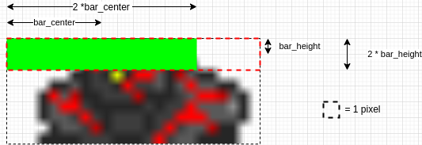

.. _doc_tutorials_custom_shaders_health_bars:

############
Health Bars
############

We create a simple 4v4 environment where agents control a `robot`. Each robot has a health value and can attacks the other robots in the environment. The aim of this environment is for the robots to defeat the otehr robots.

In this tutorial we use a custom shader and signed distance fields to draw health bars.

.. raw:: html

   

      <video onloadeddata="this.play();" playsinline loop muted height="10%">

         <source src="../../../_static/video/tutorials/custom_shaders/health_bars/global_video_test.mp4"
                    type="video/mp4">

            Sorry, your browser doesn't support embedded videos.
      </video>
      
<a class="headerlink" href="#vid1">¶</a>

   
  

************************
Calculating Health Bars 
************************

Let's say each `robot` unit has a current health value ``health`` and a maximum health value ``max_health``.

We can set the ``max_health`` and initial ``health`` value in the GDY for the `robot` units like this:

.. code:: yaml

   - Name: robot
     MapCharacter: f
     Variables:
       - Name: health
         InitialValue: 10
       - Name: max_health
         InitialValue: 10

We can then expose these variables to the shader by passing them in the ``Shader`` config for the ``Sprite2D`` renderer.

.. code:: yaml

   Sprite2D:
      Shader:
        ObjectVariables: [ health, max_health ]

These variables can then be accessed in the shader using the following helper function.

.. code:: glsl
   
   int getObjectVariable(in int objectIndex, in int variableIndex, in int numVariables) {
       return objectVariableBuffer.variables[objectIndex*numVariables+variableIndex].value;
   }

``objectIndex`` will be the value of the current object index being drawn. This value is sent to the shader as the `push constant` ``idx``.
``variableIndex`` is the index of the variable in the ``ObjectVariables``, for example, 0 for ``health`` and 1 for ``max_health``.
Finally ``numVariables`` is the number of variables that is provided in the ``ObjectVariables`` configuration. In our case this is 2.

We can retrieve the ``health`` and ``max_health`` values in the shader by calling this function with the following arguments:

.. code:: glsl

   int health = getObjectVariable(pushConsts.idx, 0, environmentData.objectVariableCount);
   int maxHealth = getObjectVariable(pushConsts.idx, 1, environmentData.objectVariableCount);

   if(object.objectType == 2) {
    outNormalizedHealth = float(health)/float(maxHealth);
   } else {
      outNormalizedHealth = -1.0;
   }

We also normalize the health value for ``robot`` objects, but set it to -1.0 for all other objects. We normalize this value here because then it makes it very simple to adjust the initial and maximum health values without changing and recompiling the shader.
It also means that this code can be re-used in environments with many objects that have many objects with different health values. 
In the fragment shader, we ignore drawing health bars when the normalized health value is less than 0. 

.. note:: ``object.objectType`` here is the index of `alphabetically` sorted object names. The ordered list of object names can also returned by calling ``env.get_object_names()``.

We dont want to calculate this for every pixel, as this is inefficient. So we put this code into the `vertex` shader and then send this value to the `fragment` shader.

Drawing Health Bars with Signed Distance Fields
===============================================

   ``bar_center`` and ``bar_height`` are used to calculate whether or not to change the colour of a pixel in the fragment shader. We calculate if the pixel is *within* the health bar and change its color accordingly. 

The fragment shader operates on every pixel that we are drawing. The coordinates of the pixel of the *texture* that we are currenty drawing are given by ``inFragTextureCoords``.
This means we can override the current pixel color with health bar if the pixel itself is *in* the area that we want to health bar to occupy.

Our health bar always has a constant height, so we can check that the current pixel is at the **top** of the texture using the following code:

.. code:: glsl

   vec2 tex_dims=vec2(textureSize(samplerArray,0));
   float bar_height=1.0/tex_dims.y;
   
   bool isAtTop = distance(inFragTextureCoords.y,bar_height)<bar_height;

Notice that we also have to normalize the height value by the texture dimensions, as the texture coordinates in ``inFragTextureCoords`` are also normalized.

This gives us a health bar of size two pixels, because the ``distance`` function will effectively check 1 pixel above and below the ``bar_height`` (1-1=0 to 1+1=2).

We can calculate the width of the bar by calculating the *horizontal center* of where we want the bar and then checking if we are close enough to this point to be part of the "health bar".

We know that when health = 1.0 (full normalized health), we want the horizontal center to be at 0.5. In this example we also align the health bar to the left. 
This conveniently means we can just set ``bar_center_x`` to be equal to ``inNormalizedHealth/2.0``.

.. code:: glsl

   float bar_center_x=inNormalizedHealth/2.0;
   
   bool isCloseToHorizontalCenter = distance(inFragTextureCoords.x,bar_center_x)<bar_center_x;

We can tie these two ``x`` and ``y`` distance fields together into a single check, and then we can change the color of the bar based on the value of ``inNormalizedHealth``.
We also want to only do this check if the ``inNormalizedHealth`` value is larger than 0. As we mentioned before, we set ``inNormalizedHealth = -1`` if there is no health bar to be rendered. 

.. code:: glsl

  if(inNormalizedHealth>0){
      vec2 tex_dims=vec2(textureSize(samplerArray,0));
      float bar_height=1.0/tex_dims.y;
      float bar_center_x=inNormalizedHealth/2.0;

      if(distance(inFragTextureCoords.x,bar_center_x)<bar_center_x&&distance(inFragTextureCoords.y,bar_height)<bar_height){
          if(inNormalizedHealth > 0.5) {
              outFragColor=vec4(0.0,1.0,0.,1.);
          } else if(inNormalizedHealth > 0.25) {
              outFragColor=vec4(1.0,1.0,0.,1.);
          } else {
              outFragColor=vec4(1.0,0.0,0.,1.);
          }
          isHealthBar = true;
      }
  }

*******************
Health Bar Shaders
*******************

We can now tie all of this together in our vertex and fragment shaders!

Vertex
======

Again in our vertex shader we have the standard boiler plate code which gives us access to the variables from the Griddly Engine. 
How this ties in with the explanation of the normalized health calculations can be seen in full here:

.. code:: glsl

   #version 460

   layout(location = 0) in vec3 inPosition;
   layout(location = 1) in vec2 inFragTextureCoords;
   
   layout(location = 0) out float outNormalizedHealth;
   layout(location = 1) out vec3 outFragTextureCoords;
   
   out gl_PerVertex {
     vec4 gl_Position;
   };
   
   struct GlobalVariable {
     int value;
   };
   
   struct ObjectVariable {
     int value;
   };
   
   struct PlayerInfo {
     vec4 playerColor;
   };
   
   struct ObjectData {
     mat4 modelMatrix;
     vec4 color;
     vec2 textureMultiply;
     int textureIndex;
     int objectType;
     int playerId;
     int zIdx;
     int isInPlayerView;
   };
   
   layout(std140, binding = 1) uniform EnvironmentData {
     mat4 projectionMatrix;
     mat4 viewMatrix;
     vec2 gridDims;
     int playerId;
     int globalVariableCount;
     int objectVariableCount;
     int globalObserverAvatarMode;
     int highlightPlayers;
   }
   environmentData;
   
   layout(std430, binding = 2) readonly buffer PlayerInfoBuffer {
     PlayerInfo variables[];
   }
   playerInfoBuffer;
   
   layout(std430, binding = 3) readonly buffer ObjectDataBuffer {
     uint size;
     ObjectData variables[];
   }
   objectDataBuffer;
   
   layout(std430, binding = 4) readonly buffer GlobalVariableBuffer {
     GlobalVariable variables[];
   }
   globalVariableBuffer;
   
   layout(std430, binding = 5) readonly buffer ObjectVariableBuffer {
     ObjectVariable variables[];
   }
   objectVariableBuffer;
   
   layout(push_constant) uniform PushConsts {
     int idx;
   }
   pushConsts;
   
   int getObjectVariable(in int objectIndex, in int variableIndex, in int numVariables) {
     return objectVariableBuffer.variables[objectIndex*numVariables+variableIndex].value;
   }
   
   void main() {
     ObjectData object = objectDataBuffer.variables[pushConsts.idx];
   
     int health = getObjectVariable(pushConsts.idx, 0, environmentData.objectVariableCount);
     int maxHealth = getObjectVariable(pushConsts.idx, 1, environmentData.objectVariableCount);
   
     if(object.objectType == 2) {
       outNormalizedHealth = float(health)/float(maxHealth);
     } else {
       outNormalizedHealth = -1.0;
     }
   
     PlayerInfo objectPlayerInfo = playerInfoBuffer.variables[object.playerId - 1];
   
     outFragTextureCoords = vec3(
         inFragTextureCoords.x * object.textureMultiply.x,
         inFragTextureCoords.y * object.textureMultiply.y,
         object.textureIndex);
   
     mat4 mvp = environmentData.projectionMatrix * environmentData.viewMatrix * object.modelMatrix;
   
     gl_Position = mvp * vec4(
                             inPosition.x,
                             inPosition.y,
                             inPosition.z,
                             1.);
   
   }

Fragment
========

The entire Fragment shader can be seen here. 
Notice also that we check if the pixel being drawn is a health bar or not, and if it is *not* we just sample from the texture array to get the pixel for the sprite image.

.. code:: glsl

   #version 460

   layout(binding = 0) uniform sampler2DArray samplerArray;

   layout(location = 0) in float inNormalizedHealth;
   layout(location = 1) in vec3 inFragTextureCoords;

   layout(location = 0) out vec4 outFragColor;

   void main() {
      bool isHealthBar = false;
      // Draw health bar at the top of the sprite using distance fields
      if(inNormalizedHealth>0){
            vec2 tex_dims=vec2(textureSize(samplerArray,0));
            float bar_height=1.0/tex_dims.y;
            float bar_center_x=inNormalizedHealth/2.0;

            if(distance(inFragTextureCoords.x,bar_center_x)<bar_center_x&&distance(inFragTextureCoords.y,bar_height)<bar_height){
               if(inNormalizedHealth > 0.5) {
                  outFragColor=vec4(0.0,1.0,0.,1.);
               } else if(inNormalizedHealth > 0.25) {
                  outFragColor=vec4(1.0,1.0,0.,1.);
               } else {
                  outFragColor=vec4(1.0,0.0,0.,1.);
               }
               isHealthBar = true;
            }
      }

      if (!isHealthBar) {
            outFragColor=texture(samplerArray,inFragTextureCoords);
      }
   }

*****************
Full Code Example
*****************

`Full code examples can be found here! <https://github.com/Bam4d/Griddly/tree/develop/python/examples/Custom%20Shaders/Health%20Bars>`_