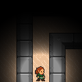
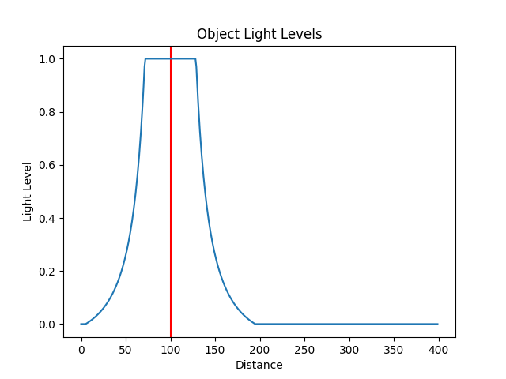
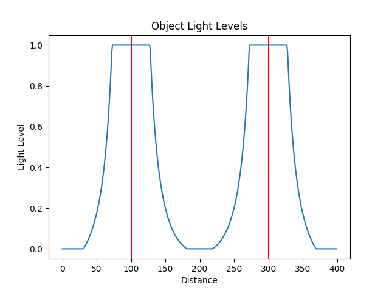

.. _doc_tutorials_custom_shaders_object_lighting:

################
Object Lighting
################

In this tutorial we will learn how to create a custom shader that performs per-object lighting. 

We modify the :ref:`Partially Observable Labyrinth <doc_partially_observable_labyrinth>` environment to be completely dark apart from around the goal state and the agent itself.

.. raw:: html

   

      <video onloadeddata="this.play();" playsinline loop muted height="10%">

         <source src="../../../_static/video/tutorials/custom_shaders/object_lighting/global_video_test.mp4"
                    type="video/mp4">

            Sorry, your browser doesn't support embedded videos.
      </video>
      
Environment rendered with global observer<a class="headerlink" href="#vid1">¶</a>

   
  

Also, because this environment is partially observable, the agent itself will see observations like below:

    Partially observable view of agent using the object shaders.

***************************
Lighting Individual Objects
***************************

Vertex shaders operate on each vertex (each corner of a sprite image), and fragment shaders operate on the individual pixels. To get the desired lighting effects, we don't need to do any calculations in the vertex shader.

In the Fragment shader however, we need to calculate how close we are to objects that emit light. Then we need to calculate how *bright* a pixel is.

Light Emitting Objects
======================

we can define light emitting objects using object variables in the GDY:

For the avatar object:

.. code:: yaml

   Name: avatar
   MapCharacter: A
   Variables:
      - Name: is_light
        InitialValue: 1

For the exit object:

.. code:: yaml

   Name: exit
   MapCharacter: x
   Variables:
      - Name: is_light
        InitialValue: 1

We can then expose these variables to the shader by passing them in the ``Shader`` config for the ``Sprite2D`` renderer.

.. code:: yaml

   Sprite2D:
      Shader:
        ObjectVariables: [ is_light ]

In the shader, we can access object variables using the following helper function:

.. code:: glsl
   
   int getObjectVariable(in int objectIndex, in int variableIndex, in int numVariables) {
       return objectVariableBuffer.variables[objectIndex*numVariables+variableIndex].value;
   }

``objectIndex`` will be the value of the current object index being drawn. This value is sent to the shader as the `push constant` ``idx``.
``variableIndex`` is the index of the variable in the ``ObjectVariables``, for example, 0 for ``is_light``. If we required other variables, they would be available at subsequenct indexes.
Finally ``numVariables`` is the number of variables that is provided in the ``ObjectVariables`` configuration. In our case this is 1 as we only define ``is_light``.

To retrieve the ``is_light`` value for any object :math:`i`,  we can call the helper function with the following arguments:

.. code:: glsl

   int isLight = getObjectVariable(i, 0, 1);

Calculating Light Levels
========================

To create the desired effect, we need to come up with a function that is lighter closer to the object, but fades out further away from the object.

we can use the following equation to work out the *brightness* :math:`B` of a pixel as a function of the inverse square of distance to each light emitting object :math:`O`. We also clip the values between 0.0 and 1.0:

.. math:: L = \max \left(0, \min \left(1, \sum\limits_{i=0}^n \left(\frac{1}{a|\overrightarrow{BO_i}|^2} - b\right)\right)\right)

:math:`n` here is the total number of light emitting objects. :math:`a` and :math:`b` are parameters we can adjust to get the desired lighting effects. 

.. note:: We use the values :math:`a=1/30` and :math:`b=0.1` in this tutorial but feel free to modify them. 

With a single object at :math:`O_0 = 100`, the plot of Lighting level :math:`L` against distance :math:`|\overrightarrow{BO_i}|`   looks like this:

With multiple objects, :math:`O_0 = 100` and :math:`O_1 = 300`:

To do this in the fragment shader, we iterate through all objects, check that the object is an object with lights (in this case, object type 0 and object type 1). We then calculate the above equation to get the light level:

.. code:: glsl

   float lightLevel = 0.0;
   for (int i = 0; i < objectDataBuffer.size; i++) {
     ObjectData object = objectDataBuffer.variables[i];
 
     if (object.objectType == 0 || object.objectType == 1) {
       int isLight = getObjectVariable(i, 0, 1);
       if (isLight == 1) {
         mat4 mv = environmentData.viewMatrix * object.modelMatrix;
         vec4 position = mv * vec4(0, 0, 0, 1);
         float dist_to_pixel = distance(position.xy, gl_FragCoord.xy);
         lightLevel += 1.0/pow(dist_to_pixel / 30.0, 2.0) - 0.1;
       }
     }
   }
 
   lightLevel = max(0, min(1.0, lightLevel));

We can then calculate the final pixel value by multiplying the light level by the RGB components of the texture that is being rendered:

.. code:: glsl
 
   outFragColor = texture(samplerArray, inFragTextureCoords) * vec4(lightLevel, lightLevel, lightLevel, 1.0);

***********************
Object Lighting Shaders
***********************

Putting all of this together in our fragement and vertex shaders we have the following:

Vertex
======

.. code:: glsl

   #version 460
   
   layout(location = 0) in vec3 inPosition;
   layout(location = 1) in vec2 inFragTextureCoords;
   
   layout(location = 0) out vec4 outColor;
   layout(location = 1) out vec3 outFragTextureCoords;
   layout(location = 2) out vec4 outPlayerColor;
   
   out gl_PerVertex {
     vec4 gl_Position;
   };
   
   struct ObjectData {
     mat4 modelMatrix;
     vec4 color;
     vec2 textureMultiply;
     int textureIndex;
     int objectType;
     int playerId;
     int zIdx;
     int isInPlayerView;
   };
   
   layout(std140, binding = 1) uniform EnvironmentData {
     mat4 projectionMatrix;
     mat4 viewMatrix;
     vec2 gridDims;
     int playerId;
     int globalVariableCount;
     int objectVariableCount;
     int globalObserverAvatarMode;
     int highlightPlayers;
   }
   environmentData;
   
   layout(std430, binding = 3) readonly buffer ObjectDataBuffer {
     uint size;
     ObjectData variables[];
   }
   objectDataBuffer;
   
   layout(push_constant) uniform PushConsts {
     int idx;
   }
   pushConsts;
   
   
   void main() {
     ObjectData object = objectDataBuffer.variables[pushConsts.idx];
   
     outFragTextureCoords = vec3(
         inFragTextureCoords.x * object.textureMultiply.x,
         inFragTextureCoords.y * object.textureMultiply.y,
         object.textureIndex);
   
     mat4 mvp = environmentData.projectionMatrix * environmentData.viewMatrix * object.modelMatrix;
   
     gl_Position = mvp * vec4(
                             inPosition.x,
                             inPosition.y,
                             inPosition.z,
                             1.);
   }

Fragment
========

.. code:: glsl

   #version 460

   layout(binding = 0) uniform sampler2DArray samplerArray;
 
   layout(location = 0) in vec4 inColor;
   layout(location = 1) in vec3 inFragTextureCoords;
   layout(location = 2) in vec4 playerColor;
 
   layout(location = 0) out vec4 outFragColor;
 
   struct GlobalVariable {
     int value;
   };
 
   struct ObjectVariable {
     int value;
   };
 
   struct PlayerInfo {
     vec4 playerColor;
   };
 
   struct ObjectData {
     mat4 modelMatrix;
     vec4 color;
     vec2 textureMultiply;
     int textureIndex;
     int objectType;
     int playerId;
     int zIdx;
     int isInPlayerView;
   };
 
   layout(std140, binding = 1) uniform EnvironmentData {
     mat4 projectionMatrix;
     mat4 viewMatrix;
     vec2 gridDims;
     int playerId;
     int globalVariableCount;
     int objectVariableCount;
     int globalObserverAvatarMode;
     int highlightPlayers;
   }
   environmentData;
 
   layout(std430, binding = 3) readonly buffer ObjectDataBuffer {
     uint size;
     ObjectData variables[];
   }
   objectDataBuffer;
 
   layout(std430, binding = 4) readonly buffer GlobalVariableBuffer {
     GlobalVariable variables[];
   }
   globalVariableBuffer;
 
   layout(std430, binding = 5) readonly buffer ObjectVariableBuffer {
     ObjectVariable variables[];
   }
   objectVariableBuffer;
 
   int getObjectVariable(in int objectIndex, in int variableIndex, in int numVariables) {
     return objectVariableBuffer.variables[objectIndex * numVariables + variableIndex].value;
   }
 
   void main() {
 
     float lightLevel = 0.0;
     for (int i = 0; i < objectDataBuffer.size; i++) {
       ObjectData object = objectDataBuffer.variables[i];
 
       if (object.objectType == 0 || object.objectType == 1) {
         int isLight = getObjectVariable(i, 0, 1);
         if (isLight == 1) {
           mat4 mv = environmentData.viewMatrix * object.modelMatrix;
           vec4 position = mv * vec4(0, 0, 0, 1);
           float dist_to_pixel = distance(position.xy, gl_FragCoord.xy);
           lightLevel += 1.0/pow(dist_to_pixel / 30.0, 2.0) - 0.1;
         }
       }
     }
 
     lightLevel = max(0, min(1.0, lightLevel));
 
     outFragColor = texture(samplerArray, inFragTextureCoords) * vec4(lightLevel, lightLevel, lightLevel, 1.0);
   } 

*****************
Full Code Example
*****************

`Full code examples can be found here! <https://github.com/Bam4d/Griddly/tree/develop/python/examples/Custom%20Shaders/Object%20Lighting>`_