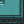
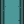
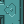

.. _doc_tutorials_gdy_objects:

Objects
=======

In this section we define the objects in the game and what they will look like when being rendered.

In the game Sokoban we control a player ``avatar`` which moves around and pushes ``boxes`` into ``holes``, there are ``walls`` that we cannot push and we cannot pass.

This means we have 4 objects in our simple Sokoban game. So we need to define them!

Step 1 - Avatar object
----------------------

Each object we have to give a unique name to. That unique name can then be used to reference that object in other parts of the GDY configuration. In for the avatar object we will call it ``avatar`` unsurprisingly.

We're going to use this image:

.. image:: img/knight1.png

.. code-block:: YAML
   
   Objects:

    - Name: avatar
      Z: 2
      MapCharacter: A
      Observers:
        Sprite2D:
          Image: images/gvgai/oryx/knight1.png

``MapCharacter`` defines the character we will use to describe initial positions in the levels defined in the ``Environment`` section of the GDY file.

``Z`` allows us to define that objects can occupy the same location in the grid, as long as they have different Z indexes. It also defines the rendering order when rendering the game. Higher Z-indexes mean the objects will be rendered on top.

The ``Observers`` block defines how each observer type will render this particular object. We are defining a ``Sprite2D`` observer here so we need to supply an image to it.

Step 2 - Wall Objects
---------------------

Wall objects are slightly more complicated because when they are rendered they actually use 15 different images, for example corner peices, T-peices etc....

.. image:: img/wall3_0.png
.. image:: img/wall3_1.png
.. image:: img/wall3_2.png
.. image:: img/wall3_3.png
.. image:: img/wall3_4.png

.. image:: img/wall3_6.png
.. image:: img/wall3_7.png
.. image:: img/wall3_8.png
.. image:: img/wall3_9.png
.. image:: img/wall3_10.png
.. image:: img/wall3_11.png

.. image:: img/wall3_14.png
.. image:: img/wall3_15.png

lets look at the object definition for walls!

.. code-block:: YAML
   
    - Name: wall
      MapCharacter: w
      Observers:
        Sprite2D:
            TilingMode: WALL_16
            Image:
            - images/gvgai/oryx/wall3_0.png
            - images/gvgai/oryx/wall3_1.png
            - images/gvgai/oryx/wall3_2.png
            - images/gvgai/oryx/wall3_3.png
            - images/gvgai/oryx/wall3_4.png
            - images/gvgai/oryx/wall3_5.png
            - images/gvgai/oryx/wall3_6.png
            - images/gvgai/oryx/wall3_7.png
            - images/gvgai/oryx/wall3_8.png
            - images/gvgai/oryx/wall3_9.png
            - images/gvgai/oryx/wall3_10.png
            - images/gvgai/oryx/wall3_11.png
            - images/gvgai/oryx/wall3_12.png
            - images/gvgai/oryx/wall3_13.png
            - images/gvgai/oryx/wall3_14.png
            - images/gvgai/oryx/wall3_15.png

Here we define the ``Name`` and the ``MapCharacter`` like we did when the avatar was defined. We dont need a Z index because nothing interacts with the ``wall`` objects.

In the ``Sprite2D`` Object there is now a ``TilingMode`` object which can either be ``WALL_2``, or ``WALL_16``. These tiling modes use 2 or 16 images respectively to render the walls in the game environment. The order of the walls is important to render the walls correctly.

Step 3 - Boxes and holes
------------------------

Boxes and holes are very similar to ``avatar`` objects. The only difference is that ``hole`` objects have a different ``Z`` value which allows the ``avatar`` object to move on top of them.

``box``:

.. image:: img/block1.png

``hole``:

.. image:: img/cspell4.png

.. code-block:: YAML

    - Name: box
      Z: 2
      MapCharacter: b
      Observers:
        Sprite2D:
          Image: images/gvgai/newset/block1.png

    - Name: hole
      Z: 1
      MapCharacter: h
      Observers:
        Sprite2D:
          Image: images/gvgai/oryx/cspell4.png

Putting it all together
-----------------------

Thats it! We've defined our objects and some properties about how they will look in the game. 

The completed ``Object`` section of our GDY file looks like this:

.. code-block:: YAML

   Objects:
    - Name: box
      Z: 2
      MapCharacter: b
      Observers:
        Sprite2D:
          Image: images/gvgai/newset/block1.png

    - Name: wall
      MapCharacter: w
      Observers:
      Sprite2D:
        TilingMode: WALL_16
        Image:
          - images/gvgai/oryx/wall3_0.png
          - images/gvgai/oryx/wall3_1.png
          - images/gvgai/oryx/wall3_2.png
          - images/gvgai/oryx/wall3_3.png
          - images/gvgai/oryx/wall3_4.png
          - images/gvgai/oryx/wall3_5.png
          - images/gvgai/oryx/wall3_6.png
          - images/gvgai/oryx/wall3_7.png
          - images/gvgai/oryx/wall3_8.png
          - images/gvgai/oryx/wall3_9.png
          - images/gvgai/oryx/wall3_10.png
          - images/gvgai/oryx/wall3_11.png
          - images/gvgai/oryx/wall3_12.png
          - images/gvgai/oryx/wall3_13.png
          - images/gvgai/oryx/wall3_14.png
          - images/gvgai/oryx/wall3_15.png

    - Name: hole
      Z: 1
      MapCharacter: h
      Observers:
        Sprite2D:
          Image: images/gvgai/oryx/cspell4.png

    - Name: avatar
      Z: 2
      MapCharacter: A
      Observers:
        Sprite2D:
          Image: images/gvgai/oryx/knight1.png
