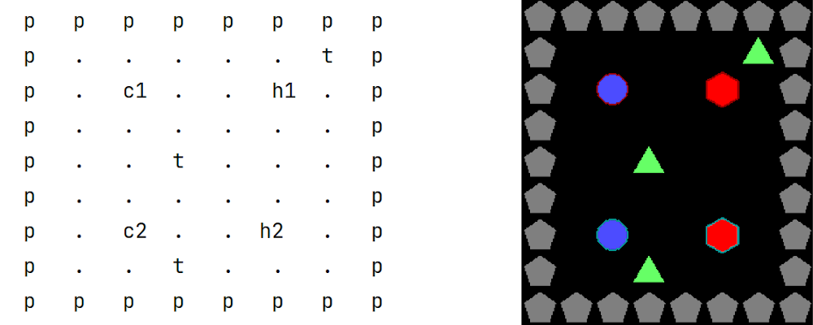

.. _doc_level_design:

#############
Level Design
#############

In this tutorial we will learn how to design levels for our environments. In GDY, Levels are built entirely using **level strings**. A level string contains characters divided by spaces, each different character corresponds to a different object in the environment. The characters that are used to place each object are configurable.

   A level string describing 4 different types of objects. Pentagons ``p``, triangles ``t``, circles ``c`` and hexagons ``h``.
   Numbers after characters refer to the player that `owns` this object. 

* **Basic Level Strings**
* **Object Ownership**
* **Stacking Objects**
* **Defining Multi-Agent Levels**
* **Player Highlighting**

**************
Level Strings
**************

Objects in the same tile
=========================

.. seealso:: we show another example of this in the :ref:`stochasticity tutorial <stochasticity_stacking_objects>`.