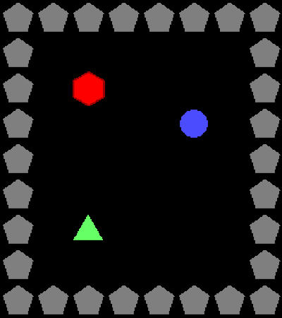
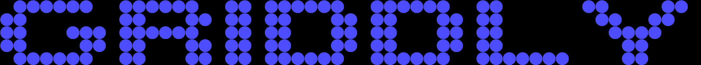

.. _doc_level_design:

#############
Level Design
#############

In this tutorial we will learn how to design levels for our environments. In GDY, Levels are built entirely using **level strings**. A level string contains characters divided by spaces, each different character corresponds to a different object in the environment. The characters that are used to place each object are configurable.

.. figure:: img/level_map.png
   :width: 80%
   :align: center

   A level string describing 4 different types of objects. Pentagons ``p``, triangles ``t``, circles ``c`` and hexagons ``h``.
   Numbers after characters refer to the player that `owns` this object. 

* **Basic Level Strings**
* **Object Ownership**
* **Stacking Objects**
* **Defining Multi-Agent Levels**
* **Player Highlighting**

********************
Level String Basics
********************

Every level has an associated ``level_string`` which defines the map of all the objects in that level. Level strings are a list of strings that make up a 2D coordinate mapping of the level. 
The list of strings is separated by a newline ``\\n`` character denoting a change in ``y`` coordinate. Within each string in the list, each character (ignoring whitespace and special characters) denotes a new object.

This explanation becomes much simpler with an example:

.. code:: yaml

   p   p   p   p   p   p   p   p 
   p   .   .   .   .   .   .   p 
   p   .   h   .   .   .   .   p 
   p   .   .   .   .   c   .   p 
   p   .   .   .   .   .   .   p 
   p   .   .   .   .   .   .   p 
   p   .   c   .   .   .   .   p 
   p   .   .   .   .   .   .   p 
   p   p   p   p   p   p   p   p

This level string defines an empty `room`, where the walls are made up of ``p`` objects there are ``c`` and ``h`` objects in the `room`. The **Map Characters** ``p``, ``c`` and ``h`` are associated with objects in the GDY.

Object Map Chacters
====================

.. code:: yaml

   - Name: hexagon
    MapCharacter: h
    Observers:
      Block2D:
        - Shape: hexagon
          Color: [1,0,0]
          Scale: 1.0

   - Name: circle
     MapCharacter: c
     Observers:
       Block2D:
         - Shape: circle
           Color: [0.3,0.3,1]

   - Name: pentagon
     MapCharacter: p
     Observers:
       Block2D:
         - Shape: pentagon
           Color: [0.5,0.5,0.5]

The ``MapCharacter`` in the object definitions tells Griddly which object to place in the each level when it is created. 
In this case the `wall` (``p``) of the room will be the ``pentagon`` object, the ``c`` object a ``circle`` and finally the ``h`` object is a ``hexagon``.

the ``.`` characters denote that there are no objects in that location. The number of spaces between each object does not matter (they are ignored).

When rendered... this environment looks like this:

*****************
Object Ownership
*****************

Lets's say we have an environment we want to build where we need to associate rewards with certain objects, but these objects are never interacted with by the player... 
For example maybe the object will disappear after a certain amount of time and the avatar loses a reward...

For this purpose we can define objects in the map as `owned` by a player. We can do this by adding a number after the map character:

.. code:: yaml

   p   p   p   p   p   p   p   p
   p   .   .   .   .   .   t   p
   p   .   c1  .   .   h1  .   p
   p   .   .   .   .   .   .   p
   p   .   .   t   .   .   .   p
   p   .   .   .   .   .   .   p
   p   .   c2  .   .   h2  .   p
   p   .   .   t   .   .   .   p
   p   p   p   p   p   p   p   p

In this map, the ``c`` and ``h`` objects are owned by different agents ``t`` and ``p`` objects are not owned by any.

Multi-Agent perspectives
=========================

In multi-agent environments, the perspective of the agent is always changed so that each agent sees itself as "player 1". This is handled in all observer types. 
For example in the ``Block2D`` observer each agent will see it's own objects with green highlighting:

.. list-table::
   :header-rows: 1

   * - Agent Perspective
     - 1
     - 2
     - Global
   * - Image
     - .. image:: img/level_1_player_1.png
     - .. image:: img/level_1_player_2.png
     - .. image:: img/level_1_global.png
   

*****************
Layering Objects
*****************

If we have more complex environments for example where different rooms may have different types of background or floors, or where objects may start ``on top`` of other objects, we can use the ``/`` character to define that an object is **on top** of another object.

.. code:: yaml

   p    p    p    p    p    p    p    p
   p    s    s    s    s    s    s    p
   p    s    s    s    s    h2/s s    p
   p    s    s    s    s    s    s    p
   p    s    s    s    s    s    s    p
   p    s    s    s    s    s    s    p
   p    s    h1/s s    s    s    s    p
   p    s    s    s    s    s    s    p
   p    p    p    p    p    p    p    p

It's also very important to define the ordering of the objects in the ``Z`` axis in the GDY. This makes sure that behaviours happen in the same priority order as they are rendered. 

For example with the square ``s`` and ``h`` objects, we define them to have ``Z`` values of 2 and 1 respectively:

.. code:: yaml

   - Name: square
     Z: 1
     MapCharacter: s
     Observers:
       Block2D:
         - Shape: square
           Color: [0.3,0.3,0.7]
           Scale: 1.5

   - Name: hexagon
     MapCharacter: h
     Z: 2
     Observers:
       Block2D:
         - Shape: hexagon
           Color: [1,0,0]
           Scale: 1.0

When rendered the hexagon objects are always rendered on top of the ``square`` objects.

.. list-table::
   :header-rows: 1

   * - Agent Perspective
     - 1
     - 2
     - Global
   * - Image
     - .. image:: img/level_2_player_1.png
     - .. image:: img/level_2_player_2.png
     - .. image:: img/level_2_global.png 

.. seealso:: we show another example of this in the :ref:`stochasticity tutorial <stochasticity_stacking_objects>`.

*********************************
Defining Levels Programmatically
*********************************

If we don't want environments with fixed maps, we can also generate maps programmatically using any algorithm we choose.
There's only two simple steps to this: 

* Generate the level string 
* Pass the level string to the ``env.reset`` function.

.. code:: python

   level_string = \
   """. c c c c c c . . c c c c c c . . c c . c c c c c c . . c c c c c c . . c c . . . . . . c c . . . . c c .  
   c c . . . . . . . c c . . . c c . c c . c c . . . c c . c c . . . c c . c c . . . . . . . c c . . c c . .  
   c c . . . c c c . c c c c c c . . c c . c c . . . c c . c c . . . c c . c c . . . . . . . . c c c c . . .  
   c c . . . . c c . c c . . . c c . c c . c c . . . c c . c c . . . c c . c c . . . . . . . . . c c . . . .  
   . c c c c c c . . c c . . . c c . c c . c c c c c c . . c c c c c c . . c c c c c c c . . . . c c . . . .
   """
   env.reset(level_string=level_string)

This gives us a level that looks like this:

   We build an environment that spells out "GRIDDLY" by rendering ascii art as an environment!

.. seealso:: If you want to know more about procedural content generation in Griddly, there's some documentation on it :ref:`here <doc_tutorials_pcg>`

*******************
Full Code Examples
******************

`Full code examples can of all the above can found here! <https://github.com/Bam4d/Griddly/tree/develop/python/examples/Level Design>`_

